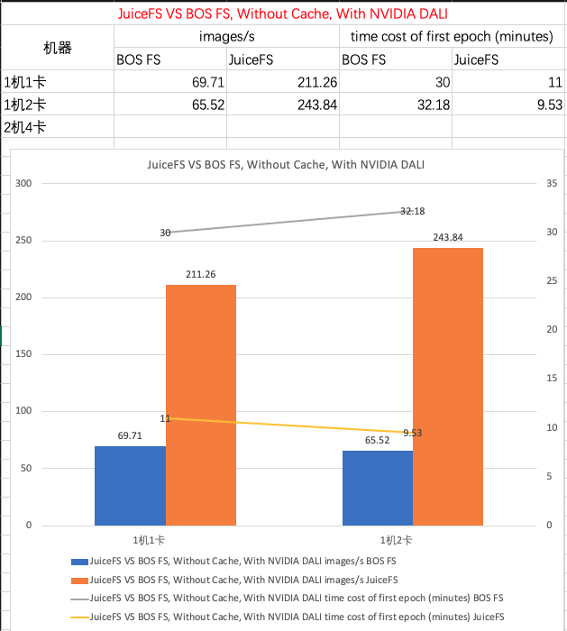
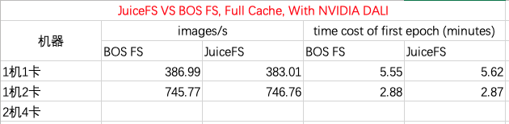

基于JuiceFS的样本缓存方案调研与测试
---

### 背景
云原生技术显然已成为当下技术发展的潮流，越来越多的机器学习任务跑在Kubernetes集群里。在云原生的架构体系中，计算与存储是分离的，样本数据一般存储在BOS等对象存储服务中，训练时需要读取远程OSS中样本文件。在大规模数据训练任务里，读取样本这个过程非常耗时，然而，一般来说用于模型训练集群机器都有比较大内存可用，如果能将训练样本缓存到本地的Page Cache中，并在后续调度训练任务时将训练任务分配到有缓存的节点，则能大大降低样本IO耗时，加快整个训练任务，目前市面上已有相应的解决方案，如[Fluid](https://github.com/fluid-cloudnative/fluid)等。

### JuiceFS概述

### 实验设计
#### CV场景
 - 模型：ResNet 50 v1.5
 - 数据集：[ImageNet](https://image-net.org/download.php)（使用的是子集）
 - 训练集：128,660 张图片 + 标签 
 - 验证集：5,000张图片 + 标签
 - 分布式架构：Ring AllReduce
 - 机器：一机多卡，多机多卡
 - 模型实现代码:[PaddleClas](https://github.com/PaddlePaddle/PaddleClas)

#### 推荐场景
- 模型：Wide & Deep
- 数据集：广告日志[Criteo](https://ailab.criteo.com/download-criteo-1tb-click-logs-dataset/)
- 分布式架构：Parameter Server 和 Ring AllReduce
- 机器：CPU集群；多机多卡。
- 模型代码实现：[PaddleRec](https://github.com/PaddlePaddle/PaddleX)

### 环境准备

#### JuiceFS安装

##### 1. 下载ImageNet数据集
ImageNet2012全集大概150G，请确认机器磁盘和带宽是否满足要求，可以参考[文档](https://github.com/PaddlePaddle/models/tree/develop/PaddleCV/image_classification#%E6%95%B0%E6%8D%AE%E5%87%86%E5%A4%87)，数据集分为三份train, test, val还包括devkit12（其中包含图片对应的分类）。 将数据下载到本地后，需要解压并将数据导入到OSS。以百度云对象存储[BOS](https://cloud.baidu.com/doc/BOS/index.html?from=productToDoc)为例，下载并安装BOS 命令行工具[bcecmd](https://cloud.baidu.com/doc/BOS/s/qjwvyqegc)，使用bcecmd bos sync命令将图片同步到Bucket。

##### 3. 安装JuiceFS客户端

    $ wget https://github.com/juicedata/juicefs/releases/download/v0.12.1/juicefs-0.12.1-linux-amd64.tar.gz
    $ tar -zxf juicefs-0.12.1-linux-amd64.tar.gz
    $ sudo install juicefs /usr/local/bin

##### 4. 创建 JuiceFS 文件系统
创建 JuiceFS 文件系统要使用 `format` 子命令，需要同时指定用来存储元数据的 Redis 数据库和用来存储实际数据的对象存储。

    $ juicefs format \
        --storage bos
        --bucket https://<bucket-name>.<region>.bcebos.com/imagenet-jfs \
        --access-key xxx \
        --secret-key xxx \
        redis://:@:6379<port>/0 \
        imagenet-

##### 5. 挂载 JuiceFS 文件系统
JuiceFS 文件系统创建完成以后，接下来就可以把它挂载到操作系统上使用了。以下命令将 `imagenet-jfs` 文件系统挂载到 `/mnt/imagenet`

    $juicefs mount --cache-dir /dev/shm/jfscache --cache-size 65536 -d redis://<username>:<password>@<host>:<port>/0 /mnt/imagenet

##### 6. 将BOS中的数据导入到JuiceFS
把 JuiceFS 挂载好以后，可以通过 juicefs sync 命令来同步已存储在BOS上的样本数据

    $juicefs sync bos://:9401ada50b8dedge<bucket-name>/imagenet-jfs file:///mnt/imagenet/

##### 7. 安装juicefs-csi-driver
拉取 JuiceFS CSI Driver 代码仓库（以下示例命令默认都是在仓库根⽬录执⾏）：

    $ git clone https://github.com/juicedata/juicefs-csi-driver.git 
    $ cd juicefs-csi-driver
    
在 K8s node 上检查 kubelet 的 root ⽬录是否为默认值`/var/lib/kubelet`:

    $ ps -ef | grep kubelet | grep 'root-dir'
    
如果不是，需要修改 JuiceFS CSI Driver 安装⽂件中的配置为对应值（这⾥以修改为`/home/test/kubelet`为例）：

    # Linux
    $ sed -i '' 's@/var/lib/kubelet@/home/test/kubelet@g' deploy/k8s.yaml
    
    # macOS （下同，不再单独说明）
    $ sed -i '' 's@/var/lib/kubelet@/home/test/kubelet@g' deploy/k8s.yaml

修改 JuiceFS CSI Driver 镜像 tag 到特定版本：

    sed -i 's@image: juicedata/juicefs-csi-driver@image: juicedata/juicefs-csi-driver:open-cache@g' deploy/k8s.yaml

挂载 K8S node 的内存盘`/dev/shm`到 JuiceFS CSI Driver 中作为数据集的缓存盘，在`deploy/k8s.yaml` 303行之后新增：

    - hostPath:
        path: /dev/shm/jfscache
        type: DirectoryOrCreate
      name: jfs-cache-dir
	  
然后在第 244 ⾏之后新增：

    - mountPath: /var/jfscache
	  name: jfs-cache-dir
	  
安装 JuiceFS CSI Driver

    kubectl apply -f ./deploy/k8s.yaml
    
##### 8. 确认 JuiceFS CSI Driver 安装成功
确认 pod 已经成功运⾏（会有两种类型的 pod，名字分别以`juicefs-csi-controller-`和`juicefs-csi-node-`开头

    $ kubectl -n kube-system get pods -l app.kubernetes.io/name=juicefs-csi-driver

如果运⾏不成功，就通过`kubectl describe pods`或者`kubectl logs`查看报错信息。

##### 9. 创建 JuiceFS Secret 和 PV
在 `examples/static-provisioning`⽬录中创建⼀个名为`secrets.env`的⽂件，这个⽂件是为了配置需要挂 载的 JuiceFS ⽂件系统的连接信息，⽂件格式如下（每个配置的解释参考[文档](https://github.com/juicedata/juicefs-csi-driver/tree/master/examples/basic#prerequisite))

    name=imagenet-jfs
    metaurl=redis://<username>:<password>@<host>:<port>/0
    storage=bos
    bucket=<bucket-name>
    access-key=<access-key>
    secret-key=<secret-key>
    
修改`examples/static-provisioning-mount-options/patches.yaml`中的`mountOptions`： 

     apiVersion: v1
        kind: PersistentVolume
        metadata:
          name: juicefs-pv
        spec:
    	  csi:
    	    volumeAttributes:
    	      mountOptions: "open-cache,cache-dir=/dev/shm/jfscache,cache-size=307200,attr-cache=7200,entry-cache=7200,dir-entry-cache=7200,prefetch=1,buffer-size=1024"
	      
生成Secret、PV、PVC和示例Pod（需要提前安装[kustomize](https://github.com/kubernetes-sigs/kustomize)）

    $ cd examples/static-provisioning-mount-options 
    $ kustomize build > juicefs.yaml
    
将Secret、PV、PVC、Pod部分的配置分别保存在文件secret.yaml、pv.yaml、pvc.yaml、test-juicefs.yaml文件中。删除test-pod.yaml中的` >> /data/out.txt`，不生成多余的文件。

    apiVersion: v1
    kind: Pod
    metadata:
      name: juicefs-app-mount-options
      namespace: default
    spec:
      containers:
      - args:
        - -c
        - while true; do echo $(date -u) ; sleep 5; done
        command:
        - /bin/sh
        image: centos
        name: app
        resources:
          requests:
            cpu: 10m
        volumeMounts:
        - mountPath: /data
          name: data
      volumes:
      - name: data
        persistentVolumeClaim:
          claimName: juicefs-pvc-mount-options

创建Secret，PV，PVC和测试Pod

    $ kubectl apply -f secret.yaml
    $ kubectl apply -f pv.yaml
    $ kubectl apply -f pvc.yaml
    $ kubectl apply -f test-juicefs.yaml

##### 10. 确认示例 app 运⾏成功
查看示例 app 是否正常运⾏：

    $ kubectl get pods juicefs-app-mount-options
    
 查看pod juicefs-app-mount-options /data 目录下是否有样本数据集：

    $ kubectl exec -it juicefs-app-mount-options -- ls -hl /data
 

#### BOSFS安装

#### 测试镜像

 
### 实验记录

实验硬件信息：

 - 系统：Ubuntu 5.4.0-6ubuntu1~16.04.10
 - CPU：Intel(R) Xeon(R) Gold 6148 CPU @ 2.40GHz * 16
 - GPU：Tesla V100-SXM2-16GB
 - 内存：DDR4 64GB
 - 网络：50Mbps带宽

实验软件信息：

 - JuiceFS: 社区版 V0.14.2
 - BOS FS: 1.0.0.10
 - 模型：ResNet50 V1.5
 - 训练参数：BatchSize 96
 - 样本数据：ImageNet train set 128,660

实验一：无缓存，使用NVIDIA DALI的情况下，JuiceFS与BOS FS的对比实验

实验二：无缓存，不使用NVIDIA DALI的情况下，JuiceFS与BOS FS的对比实验

实验三：缓存全部训练样本的情况下（缓存路径为`/dev/shm`），JuiceFS与BOS FS的对比实验

### 结论

 1. 在本地机器没有缓存数据的情况下，JuiceFS拉取训练样本的速度大概比BOS FS快2-3倍，JuiceFS在小文件IO场景有比BOS FS更优的性能。 
 2. 对比实验一和实验三，实验一中1机2卡训练速度并不比1机1卡快，实验一1机2卡的性能瓶颈主要在带宽和拉取小样本文上。
 3. 根据实验三的数据，样本数据全量缓存后，在上诉实验条件下，单张GPU卡的训练最大速度大概为383 images/s (不使用DALI也是这样)。

#### 注意事项
 - 除了测试在样本已有cache的情况，还要测试训练前无cache的情况，将样本从BOS到本地缓存的throughput，latency也要计算在内。
 - 缓存引擎普遍存在针对特定场景参数调优的情况，参数设置不合理可能会导致测试结果不备参考性,例如 Fuse 是否开启 page cache。

